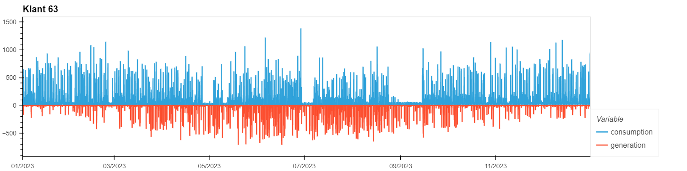

<!--
SPDX-FileCopyrightText: 2026 Contributors to the sundael project.
SPDX-License-Identifier: MPL-2.0
-->

# Sundael

Module to disaggregate generation and consumption from import (net consumption) and export 
(net generation) profiles, or a net load profile. Generation is based on average PV profiles,
optionally per area (for instance by postal code), corrected for installation size, tilt and orientation. These are calculated based on the [SunDance](https://dl.acm.org/doi/10.1145/3077839.3077848) algorithm.


## Example usage

### Required data

The [SunDance algorithm](https://dl.acm.org/doi/10.1145/3077839.3077848) disaggregates solar generation from net meter data. 


For a more detailed example, see the notebook [examples/example_usage.ipynb](examples/example_usage.ipynb).

```
from sundael import PVDisaggregator

pv = PVDisaggregator(pv_ratio=pv_ratio) 
result = pv.disaggregate(net_consumption, net_generation)
```
Visualize the results.

```
# Show one example of "Klant 63"
import hvplot.pandas

idx = "Klant 63"

pd.concat(
    (
        result["consumption"].loc[idx].rename("consumption"),
        result["generation"].loc[idx].rename("generation") * -1,
    ),
    axis=1

).fillna(0).hvplot(width=1200, title=idx)
```


## Configuration

Defaults are managed through a Pydantic config object in [src/sundael/config.py](src/sundael/config.py).

```python
from sundael.config import PVConfig

# Start from package defaults and override only what you need.
config = PVConfig(latitude=52.1, longitude=5.1)
```

Use this config in the disaggregator:

```python
from sundael import PVDisaggregator

pv = PVDisaggregator(pv_ratio=pv_ratio, config=config)
result = pv.disaggregate(netload=netload)
```


## Getting Started

### Local
To get a local copy up and running, follow these steps:

1. **Clone the repository**

```bash
git clone https://github.com/Alliander/sundael
```

2. **Install dependencies**

```bash
uv sync
```

### Setup pre-commit

The pre-commit hook runs ruff and mypy checks before you commit to the repository. First, install pre-commit if you haven't done so already:

```bash
pip install pre-commit
```

Then, install the hook: 

```bash
pre-commit install
```

The pre-commit hook ensures your code adheres to standards. If, for a certain commit, you want to skip the checks, pass a `--no-verify` flag to git commit.

### Contributing code: style and commits

In short, we use [Conventional Commits](https://www.conventionalcommits.org/en/v1.0.0/) for commit messages and follow conventional Python code guidelines, 
including [PEP8](https://peps.python.org/pep-0008/). See [CONTRIBUTING.md](CONTRIBUTING.md) for more details. 

### Testing your package locally

Run pytest:

```
uv run pytest
```

### Local code quality checks

We use [ruff](https://docs.astral.sh/ruff/) for linting and code quality. It replaces other tools such as black, 
isort and flake8 (and is really fast). 

> [!NOTE]  
> For Visual Studio Code you can install the [ruff extension](https://marketplace.visualstudio.com/items?itemName=charliermarsh.ruff)
> and enable linting and auto-formatting on save.

Before you publish your changes, run the code quality checks that are done in the workflow, to prevent unexpected failed runs:

```bash
uv run ruff check .
uv run mypy .
```

To format code with ruff:

```bash
uv run ruff format .
```

To automatically fix any errors:

```bash
uv run ruff check --fix .
```

## License

This project is licensed under the Mozilla Public License, Version 2.0, see [LICENSE](LICENSE) for details.

## Contributing

Please read
[CODE_OF_CONDUCT](CODE_OF_CONDUCT.md),
[CONTRIBUTING](CONTRIBUTING.md)
and
[PROJECT GOVERNANCE](PROJECT_GOVERNANCE.md)
for details on the process
for submitting pull requests to us.

## Contact

Please read [SUPPORT](SUPPORT.md) for how to
get in touch with the sundael project.
